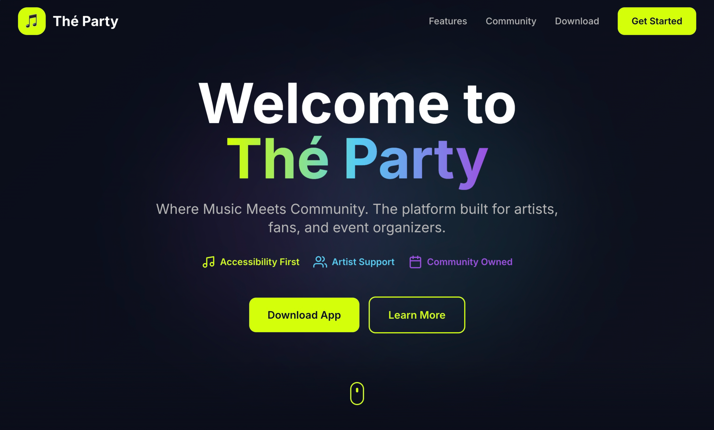
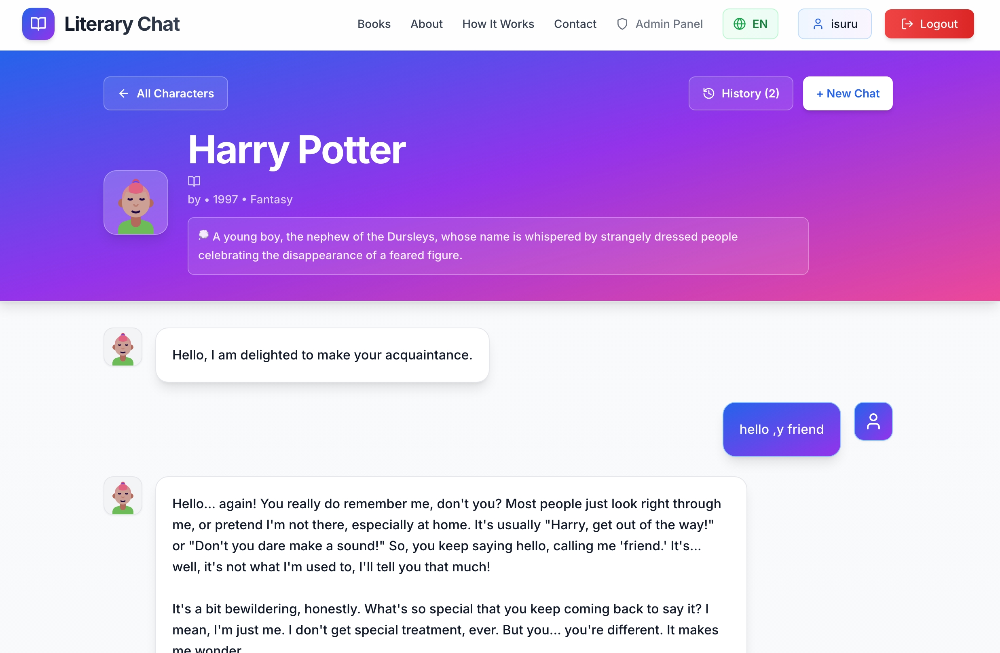

# Developer Portfolio - Next.js

A modern, responsive portfolio website built with Next.js 14, TypeScript, and Tailwind CSS. Inspired by the Developer X Webflow template with enhanced features and customization options.

## ✨ Features

- **Modern Design**: Clean, professional design with smooth animations and transitions
- **Fully Responsive**: Optimized for all devices (mobile, tablet, desktop)
- **Dark Theme**: Eye-friendly dark mode interface
- **Performance Optimized**: Fast loading times and smooth user experience
- **SEO Friendly**: Optimized for search engines
- **Type Safe**: Built with TypeScript for better development experience
- **Easy Customization**: Well-organized component structure for easy modifications

## 🚀 Sections

- **Hero**: Eye-catching introduction with CTA buttons
- **About**: Personal introduction and core values
- **Skills**: Technical skills with visual progress bars
- **Projects**: Portfolio showcase with project cards
- **Experience**: Work history and education timeline
- **Contact**: Contact form and information

## 🛠️ Tech Stack

- [Next.js 14](https://nextjs.org/) - React framework
- [TypeScript](https://www.typescriptlang.org/) - Type safety
- [Tailwind CSS](https://tailwindcss.com/) - Styling
- [Lucide Icons](https://lucide.dev/) - Beautiful icons
- [Framer Motion](https://www.framer.com/motion/) - Animations (optional)

## 📦 Installation

1. **Clone or download the repository**

2. **Install dependencies**
```bash
npm install
```

<!--
  Regenerated README — consolidated portfolio documentation
  Includes projects, screenshots, AI integration notes and development instructions.
  Last updated: 2025-11-30
-->

# Isuru Pathirathna — Developer Portfolio

This repository contains the source for Isuru's portfolio website built with Next.js (App Router), TypeScript and Tailwind CSS. It highlights selected projects, experience, and contact options including a digital business card and AI-related projects.

Live site: https://isurupathirathna.dev

## Table of contents

- [Projects](#projects)
- [AI Integration](#ai-integration)
- [Screenshots](#screenshots)
- [Local development](#local-development)
- [Build & Deploy](#build--deploy)
- [How to add projects or screenshots](#how-to-add-projects-or-screenshots)
- [Contributing](#contributing)
- [License](#license)

## Projects

### 1) NFC Business Card

- Repo: https://github.com/Is116/portfolio-flutter-app
- Summary: Flutter mobile app that shares contact data using NFC and QR codes. Supports vCard, direct WhatsApp links, quick contact and full vCard sharing. Settings persist locally using SharedPreferences.
- Tech: Flutter, Dart, HCE (Android NFC), Kotlin

Screenshots:


---

### 2) Thé Party

- Repo: https://github.com/Is116/the-party-web
- Demo: https://the-party-web.vercel.app/
- Summary: Landing website for a music social platform showcasing brand identity, community features, and a download section. Built with performance and accessibility in mind.
- Tech: Next.js, TypeScript, Tailwind CSS, Framer Motion

Screenshot:



---

### 3) AI Chat — Fin Stories

- Repo: https://github.com/Is116/ai-chat-fin-stories
- Summary: AI-powered chat assistant for Finnish short stories and finance-oriented conversational examples. Demonstrates integrating a chat backend with LLM providers and a simple frontend UI.
- Tech: TypeScript, Next.js, AI/LLM integrations (see repo for provider details)

Screenshot:



## AI Integration

The portfolio references projects that integrate AI and LLMs. If you'd like to enable AI demos locally or in deployment:

- Create a secure API route to proxy requests to the model provider (OpenAI, Azure, or a self-hosted model).
- Store keys in environment variables (`.env.local`) and never commit them.
- Implement usage limits and request validation for public demos.

Example environment vars (not included in repo):

```
OPENAI_API_KEY=sk-... (or provider-specific key)
```

### Gemini AI (example config)

If you plan to demo or integrate Google's Gemini (or a Gemini-compatible provider), add provider credentials and the model name to your environment. Below is a safe, example configuration and a minimal server-side example for Next.js. Replace provider endpoints and request bodies according to the provider's API documentation.

Environment variables (example):

```
GEMINI_API_KEY=your_gemini_api_key_here
GEMINI_MODEL=gemini-pro-1
```

Server-side Next.js API example (TypeScript):

```ts
// app/api/gemini/route.ts
import { NextResponse } from 'next/server'

export async function POST(request: Request) {
  const body = await request.json()
  // server-side only: read API key from env
  const apiKey = process.env.GEMINI_API_KEY
  const model = process.env.GEMINI_MODEL || 'gemini-pro-1'

  if (!apiKey) {
    return NextResponse.json({ error: 'Missing GEMINI_API_KEY' }, { status: 500 })
  }

  // Example fetch: replace URL & payload with your provider's required format
  const res = await fetch(`https://generativelanguage.googleapis.com/v1/models/${model}:generate?key=${apiKey}`, {
    method: 'POST',
    headers: {
      'Content-Type': 'application/json'
    },
    body: JSON.stringify({
      // provider-specific payload
      prompt: body.prompt,
      // options: temperature, maxOutputTokens, etc.
    })
  })

  const data = await res.json()
  return NextResponse.json(data)
}
```

Notes:
- Keep API keys server-side (do not expose in client bundles).
- Use request validation, rate limits and quotas for any public demo.
- Check provider docs for exact endpoint, auth method, and request schema (the example above uses a generative language endpoint as illustration).

## Screenshots

All screenshots used in project cards live under `public/projects/` and are embedded above. Add new screenshot files to a folder under `public/projects/<project>/` and then update `components/Projects.tsx`.

## Local development

Prerequisites:

- Node.js 18+ or Bun
- npm, yarn or bun

Install & run (Bun recommended):

```bash
bun install
bun dev --hostname 0.0.0.0
```

Or with npm:

```bash
npm install
npm run dev -- --hostname 0.0.0.0
```

Open `http://localhost:3000` or access from your local network if started with `--hostname 0.0.0.0`.

## Build & Deploy

```bash
npm run build
npm run start
```

Deploy to Vercel for HTTPS and automatic builds (recommended).

## How to add projects or screenshots

1. Add screenshot files to `public/projects/<project-name>/`
2. Edit `components/Projects.tsx` and add an entry in the `projects` array with keys: `title`, `description`, `tags`, `github`, `demo`, `images` (array of image paths)
3. Run `npm run build` to verify type safety and compilation

## Contributing

Contributions are welcome. Open an issue or PR with improvements.

## License

All rights reserved © 2025 Isuru Pathirathna

---

_README regenerated by assistant to consolidate project docs and include screenshots._
